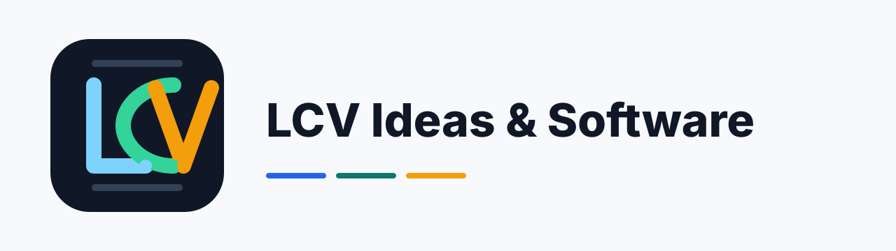

<p align="center">
  
</p>

# sponsor-motor

[](#status)
[](https://github.com/LCV-Ideas-Software/sponsor-motor/actions/workflows/ci.yml)
[](https://github.com/LCV-Ideas-Software/sponsor-motor/actions/workflows/deploy.yml)
[](https://github.com/LCV-Ideas-Software/sponsor-motor/actions/workflows/pages.yml)
[](https://github.com/LCV-Ideas-Software/sponsor-motor/actions/workflows/codeql.yml)
[](https://workers.cloudflare.com/)
[](https://www.mercadopago.com.br/developers/)
[](./LICENSE)

Cloudflare Worker dedicado para processar apoios/doações via Mercado Pago Checkout Transparente com Orders API para a LCV Ideas & Software.

**Status.** Stable. Current application version: **APP v01.02.08**. This web app
keeps an internal version and does not publish GitHub Releases or version tags.
See [CHANGELOG.md](./CHANGELOG.md) for the full change history.

## Change History

The internal application version history at a glance:

| Versão          | Mudanças                                                                                                                                                                                                                                                                                                                                                                                                                                  |
| --------------- | ----------------------------------------------------------------------------------------------------------------------------------------------------------------------------------------------------------------------------------------------------------------------------------------------------------------------------------------------------------------------------------------------------------------------------------------- |
| **`v01.02.08`** | **Admin CLI (issue #152).** `scripts/sponsor-admin.mjs` wraps the operator-only endpoints (status/cancel/refund, partial refunds included) with interactive confirmation, env-only token and distinct exit codes. Talks only to the worker API — provider-agnostic, survives the migration planned in #186.                                                                                                                               |
| **`v01.02.07`** | **Integrator ID via Secrets Store (issue #151).** `MERCADOPAGO_INTEGRATOR_ID` now resolves the Cloudflare Secrets Store binding shape like the other Mercado Pago credentials; plain var/classic secret keep working. Production activation still requires the real Programa de Parcerias value (checklist in the integration-quality doc).                                                                                               |
| **`v01.02.06`** | **Security and Cloudflare toolchain patch.** Updates Hono to 4.12.34 for GHSA-8j4g-w8fx-2239, moves Wrangler to the current-compatible 4.118 line and scopes Undici 7.29.0 to Miniflare.                                                                                                                                                                                                                                                  |
| **`v01.02.05`** | **Security patch.** Raised the transitive `ws` override floor to 8.21.0 to clear the high-severity memory-exhaustion DoS advisory (GHSA-96hv-2xvq-fx4p) flagged by the OpenSSF Scorecard Vulnerabilities check, and synchronized APP_VERSION/package metadata to v01.02.05.                                                                                                                                                               |
| **`v01.02.04`** | **4-gate quality directive compliance.** Added explicit Biome workflow steps before the existing aggregate checks, updated the Biome schema, applied cosmetic source formatting, and synchronized APP_VERSION/package metadata to v01.02.04.                                                                                                                                                                                              |
| **`v01.02.03`** | **Site sponsor card iteration.** `site/index.html` GitHub Sponsors iframe (caixa branca cross-origin) substituído por link card dark navy com ❤ pink + meta cyan + seta animada; card movido para DEPOIS dos botões (lcv.dev/sponsor primário, GitHub Sponsors alternativa). Companion ship Phase 3 (12 repos).                                                                                                                           |
| **`v01.02.02`** | **Identidade visual da LCV Ideas & Software.** Reskin de `site/index.html` (GitHub Pages) em cores dark-first navy/cyan institucional atual (`#050b18`/`#38bdf8`/`#34d399`, gradientes, glow). Companion ship coordenado com `cross-review-v1` 1.12.9, `cross-review-v2` v02.18.07, `deepseek-cli` 0.3.1, `grok-cli` 1.6.2 e `.github-org/site` (LCV Ideas & Software). Sem mudança no Worker runtime; apenas a página GitHub Pages muda. |
| **`v01.02.01`** | **Página pública e catálogo de sponsor.** Publica `site/` no padrão dos demais repositórios em `sponsor-motor.lcv.dev`, adiciona `Sponsor Motor` ao catálogo aceito pelo backend e à página central `/sponsor`.                                                                                                                                                                                                                           |
| **`v01.02.00`** | **Operações e qualidade Mercado Pago.** Adiciona `MERCADOPAGO_INTEGRATOR_ID`, `payerLastPurchase`, endpoints operador-only de cancelamento/reembolso e cobertura de testes para essas rotas administrativas.                                                                                                                                                                                                                              |
| **`v01.01.07`** | **Boas práticas Mercado Pago/3DS.** Criação de Orders via SDK oficial, telefone opcional do pagador, fallback server-side de status por Orders API, logs sem PII e manual de qualidade da integração.                                                                                                                                                                                                                                     |
| **`v01.01.06`** | **Fluxo 100% Orders API.** Desativa o fallback Checkout Pro/Conta Mercado Pago, remove a opção wallet, pré-registra tentativas antes da chamada ao MP e preserva estados de webhook ao separar IDs `PAY...` de Payment IDs numéricos.                                                                                                                                                                                                     |
| **`v01.01.05`** | **Webhook Mercado Pago com `ts` em segundos.** Assinaturas reais da dashboard agora validam `x-signature.ts` em segundos ou milissegundos, corrigindo `401` em notificações como `payment.created`.                                                                                                                                                                                                                                       |
| **`v01.01.04`** | **Webhook Mercado Pago compatível com a dashboard.** Todos os tópicos marcados no painel são aceitos com assinatura válida; testes oficiais com IDs fictícios retornam `200 OK` e ficam auditados sem esconder falhas reais não-404.                                                                                                                                                                                                      |
| **`v01.01.03`** | **Compliance Orders API ampliado.** Orders agora enviam sobrenome, endereço do pagador, endereço de entrega e `additional_info` antifraude aceito; `/api/preferences` suporta Conta Mercado Pago com `purpose=wallet_purchase`.                                                                                                                                                                                                           |
| **`v01.01.02`** | **Payload Orders API corrigido.** Remove `additional_info` não aceito pela Orders API, cria orders por REST controlado e evita converter recusas com `data.id` em erro 500.                                                                                                                                                                                                                                                               |
| **`v01.01.01`** | **Alinhamento de credenciais Mercado Pago.** Public Key do Secrets Store foi atualizada a partir de `Secrets/variaveis_secretas.txt` para casar com o Access Token atual, e erros da SDK passaram a preservar causa segura.                                                                                                                                                                                                               |
| **`v01.01.00`** | **Checkout Transparente via Orders API.** Fluxo principal migrou para MercadoPago.js V2/Card Payment Brick no frontend e `/v1/orders` no backend, com Secure Fields, `Order ID`, `items.category_id=services` e 3DS `on_fraud_risk`.                                                                                                                                                                                                      |
| **`v01.00.03`** | **Hotfix SDK no Cloudflare Workers.** Adiciona compatibilidade `Headers.raw()` para a SDK oficial `mercadopago`, corrigindo criação de preferências no runtime Cloudflare com `nodejs_compat`.                                                                                                                                                                                                                                            |
| **`v01.00.02`** | **Mercado Pago SDK oficial.** Backend passou a criar/consultar pagamentos com o SDK oficial `mercadopago`, envia `items.category_id=services` e expõe `/api/config` com Public Key para integrações frontend.                                                                                                                                                                                                                             |
| **`v01.00.01`** | **DeepSeek CLI no catálogo de sponsor.** `deepseek-cli` passou a ser aceito em `/api/projects` e `/api/preferences`, habilitando o checkout central por `project=deepseek-cli`.                                                                                                                                                                                                                                                           |
| **`v01.00.00`** | **Mercado Pago sponsor backend.** Novo Worker dedicado com Checkout Pro preferences, webhook assinado, auditoria em tabelas `sponsor_*` no `example_db`, Secrets Store bindings e página pública central em `https://www.lcv.dev/sponsor`.                                                                                                                                                                                                |

## Arquitetura

- Página pública: `https://www.lcv.dev/sponsor`.
- API pública: `https://sponsor-motor.lcv.app.br`.
- Banco: `bigdata_db`, com tabelas `sponsor_payments`, `sponsor_payment_events` e `sponsor_rate_limits`.
- Secrets Store: `mp-access-token`, `mercadopago-webhook-secret`, `mercadopago-public-key`.
- Backend Mercado Pago: SDK oficial `mercadopago`, com `nodejs_compat` no Worker para suportar a biblioteca Node.
- Frontend Mercado Pago: a página `https://www.lcv.dev/sponsor` carrega MercadoPago.js V2 e renderiza Card Payment Brick com Secure Fields.
- Backend principal: `POST /api/orders` cria uma order com `Order.create` da SDK oficial `mercadopago@3.4.0`, cartão tokenizado, item categorizado e 3DS por risco.
- Fallback Checkout Pro: `POST /api/preferences` permanece bloqueado com `410 Gone`; a integração ativa é somente Checkout Transparente + Orders API.
- O custom domain `sponsor-motor.lcv.app.br` fica declarado em `wrangler.json` como `custom_domain: true`; o token de deploy precisa manter permissão de gerenciamento de Workers/Custom Domains na zona `lcv.app.br`.

## Rotas

- `GET /api/health`
- `GET /api/config`
- `GET /api/projects`
- `POST /api/orders`
- `POST /api/preferences` retorna `410 Gone` para impedir mistura com Checkout Pro.
- `GET /api/status/:externalReference`
- `POST /api/webhooks/mercadopago`
- `POST /api/orders/:orderId/cancel` e `POST /api/orders/:orderId/refund` — operator-only
  (`Authorization: Bearer $SPONSOR_OPERATOR_TOKEN`).

## Administração (CLI)

Superfície administrativa sem curl artesanal — `scripts/sponsor-admin.mjs` fala apenas com a
API do worker (agnóstica de provedor):

```bash
# somente leitura (endpoint público)
node scripts/sponsor-admin.mjs status <externalReference>

# operações do operador (exigem SPONSOR_OPERATOR_TOKEN no ambiente; confirmação interativa,
# use --yes para pular; --amount/--transaction-id para reembolso parcial)
node scripts/sponsor-admin.mjs cancel <orderId>
node scripts/sponsor-admin.mjs refund <orderId> [--amount 12.34] [--transaction-id ID]
```

`SPONSOR_API_BASE_URL` sobrepõe a base (default produção). Exit codes: `0` sucesso,
`1` erro da API, `2` uso inválido/abortado. O token nunca é aceito por argv.

## Webhooks Mercado Pago

O endpoint `POST /api/webhooks/mercadopago` valida `x-signature`/`x-request-id`, registra todos os eventos em `sponsor_payment_events` e processa de forma específica os tópicos habilitados no painel Mercado Pago:

- Pagamentos: `payment`
- Order (Mercado Pago): `order`, `orders`
- Alertas de fraude: `stop_delivery_op_wh`, `delivery_cancellation`
- Card Updater: `topic_card_id_wh`, `automatic-payments`
- Vinculação de aplicações: `mp-connect`
- Reclamações: `topic_claims_integration_wh`, `claim`
- Contestações: `topic_chargebacks_wh`, `chargeback`
- Envios: `shipment`, `shipments`
- Planos e assinaturas: `subscription_authorized_payment`, `subscription_preapproval`, `subscription_preapproval_plan`
- Delivery: `delivery`
- Pedidos comerciais: `topic_merchant_order_wh`, `merchant_order`
- Integrações Point: `point_integration_wh`
- Wallet Connect: `wallet_connect`
- Self Service: `self_service`

## Desenvolvimento

```powershell
npm ci
npm run check
```

## Qualidade da integração Mercado Pago

O checklist operacional fica em [`docs/mercadopago-integration-quality.md`](docs/mercadopago-integration-quality.md).

Resumo dos pontos críticos preservados:

- Orders API pura: `POST /api/preferences` segue bloqueado com `410 Gone`.
- Card Payment Brick/Secure Fields: a LCV Ideas & Software não recebe número, validade nem CVV.
- SDK oficial no backend: criação/consulta de orders usam `mercadopago`.
- Idempotência: cada tentativa usa `X-Idempotency-Key` único derivado da `external_reference`.
- 3DS: `config.online.transaction_security.validation=on_fraud_risk`, `liability_shift=required` e Challenge lido em `transactions.payments[i].payment_method.transaction_security.url`.
- Fallback de status: se o webhook demorar, `/api/status/:externalReference` consulta a Orders API server-side sem expor credenciais.
- Logs internos: eventos de criação, webhook e fallback são registrados sem PII.

## Deploy

O workflow `Deploy` usa o binding oficial versionado para `bigdata_db`, aplica migrations remotas e publica o Worker com o Wrangler Action oficial. O UUID da D1 e identificador, nao credencial; tokens continuam fora do repositorio. Como migrations e deploy sao operacoes sequenciais, toda migration deve ser retrocompativel com a revisao anterior do Worker.

## Segurança

- O Access Token Mercado Pago fica somente no Cloudflare Secrets Store.
- A Public Key é exposta por `/api/config` para inicializar MercadoPago.js V2 no frontend.
- O webhook valida `x-signature` e `x-request-id` com HMAC SHA-256 antes de processar eventos `order` ou `payment`.
- Dados de pagador são armazenados apenas como hash SHA-256.
- Dados de cartão são capturados exclusivamente pelos Secure Fields do Card Payment Brick; `sponsor-motor` recebe apenas token transitório.
- `items.category_id` é enviado como `services` para melhorar sinais de aprovação do Mercado Pago em serviços digitais.
- Orders usam `config.online.transaction_security.validation=on_fraud_risk` e `liability_shift=required` para 3DS conforme risco.
- Orders enviam `payer.first_name`, `payer.last_name`, `payer.phone` quando informado, `payer.address`, `shipment.address` e `additional_info` antifraude aceito pela Orders API para melhorar a medição de qualidade sem persistir PII em claro.
- O pagamento é considerado confirmado apenas após webhook/consulta server-side ao Mercado Pago.

## Repository conventions

- **License**: [AGPL-3.0-or-later](./LICENSE). Network-service trigger applies: running a modified fork as a public service obligates you to publish modifications.
- **Notices**: see [NOTICE](./NOTICE) and [THIRDPARTY](./THIRDPARTY.md).
- **Security disclosure**: see [SECURITY.md](./SECURITY.md).
- **Code of conduct**: see [CODE_OF_CONDUCT.md](./CODE_OF_CONDUCT.md).
- **Changelog**: [CHANGELOG.md](./CHANGELOG.md).
- **Contributing**: see [CONTRIBUTING.md](./CONTRIBUTING.md).
- **Sponsorship**: see the repo's `Sponsor` button or [central sponsor page](https://www.lcv.dev/sponsor).
- **Action pinning**: all GitHub Actions are pinned by full SHA per supply-chain hardening baseline.
- **Code owners**: [.github/CODEOWNERS](.github/CODEOWNERS).

## Links

- Site: [https://sponsor-motor.lcv.dev](https://sponsor-motor.lcv.dev)
- GitHub: [https://github.com/LCV-Ideas-Software/sponsor-motor](https://github.com/LCV-Ideas-Software/sponsor-motor)
- Sponsors: [https://github.com/sponsors/LCV-Ideas-Software](https://github.com/sponsors/LCV-Ideas-Software)

## License

AGPL-3.0-or-later. See [LICENSE](./LICENSE), [NOTICE](./NOTICE), and [THIRDPARTY](./THIRDPARTY.md).

---

<p align="center"><span style="font-size: 1.5em;"><strong>Copyright © 2026 LCV Ideas &amp; Software</strong></span><br><sub>LEONARDO CARDOZO VARGAS TECNOLOGIA DA INFORMACAO LTDA<br>Rua Pais Leme, 215 Conj 1713 - Pinheiros<br>São Paulo - SP - CEP 05424-150<br>CNPJ: 66.584.678/0001-77 - IM: 3039854</sub></p>
